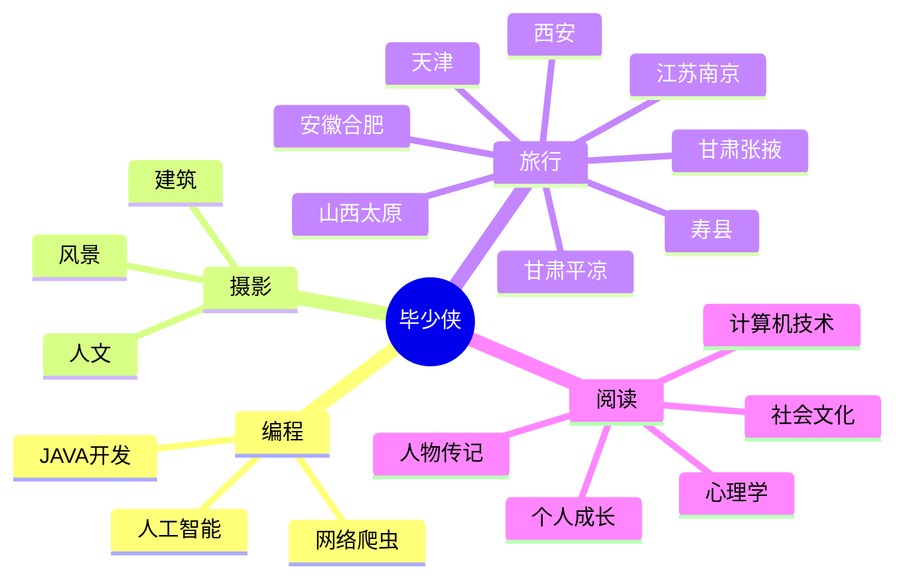

<div align="center">
  
  <!-- dynamic typing effect 动态打字效果 -->
  <div align="center">
    <a href="https://geekswg.js.cool"></a>
  </div>

  <!-- knock code pictures 敲代码的图片 -->
  <br>

  <!-- profile logo 个人资料徽标 -->
  <div align="center">
    <a href="https://geekswg.js.cool/"></a>&emsp;
    <a href="https://twitter.com/geekswg/"></a>&emsp;
    <a href="https://www.youtube.com/@geekswg"></a>&emsp;
    <a href="https://box.sunguoqi.com/weixin_mp"></a>&emsp;
    <a href="https://space.bilibili.com/448488855/"></a>&emsp;
    <a href="https://blog.csdn.net/weixin_50915462/"></a>&emsp;
    <a href="https://www.zhihu.com/people/sunguoqi/"></a>&emsp;
    <!-- visitor statistics logo 访客数统计徽标 -->
    
  </div>

  <!-- Snake Code Contribution Map 贪吃蛇代码贡献图 -->
<picture>
  <source media="(prefers-color-scheme: dark)" srcset="https://cdn.jsdelivr.net/gh/geekswg/geekswg/profile-snake-contrib/github-contribution-grid-snake-dark.svg" />
  <source media="(prefers-color-scheme: light)" srcset="https://cdn.jsdelivr.net/gh/geekswg/geekswg/profile-snake-contrib/github-contribution-grid-snake.svg" />
  
</picture>

</div>

#  🙋 Hello

<table style="width:100%;">

<tr style="width:100%;"><td>

<!-- 近期博客 -->
### 📃 Recent Blog
  


<!-- START_SECTION:blog -->
* <a href='https://geekswg.js.cool/archives/ohmyposh' target='_blank'>Oh My Posh | Windows Terminal 美化指南</a> - 2023-07-15
* <a href='https://geekswg.js.cool/archives/brain' target='_blank'>小孙同学 の 第二大脑正在施工中 。。。</a> - 2023-03-26
* <a href='https://geekswg.js.cool/archives/20230225' target='_blank'>奔跑在自己的时区里，你好哇，我的22岁！</a> - 2023-02-25
* <a href='https://geekswg.js.cool/archives/github_profile_0' target='_blank'>让面试官眼前一亮，手把手带你打造个性化的 GitHub 首页</a> - 2023-01-30
* <a href='https://geekswg.js.cool/archives/chatgpt' target='_blank'>快速上手，教你如何将 ChatGPT 接入到微信公众号</a> - 2023-01-29
<!-- END_SECTION:blog -->

</td></tr>

<tr><td>

### 🧠 Second Brain


<!-- START_SECTION:brain -->
* <a href='https://brain.sunguoqi.com/dv/basic/00.html' target='_blank'>可视化工程师</a> - 2023-07-26
* <a href='https://brain.sunguoqi.com/dv/basic/09.html' target='_blank'>用仿射变换操作几何图形</a> - 2023-07-26
* <a href='https://brain.sunguoqi.com/dv/basic/10.html' target='_blank'>图形系统如何表示颜色</a> - 2023-07-26
* <a href='https://brain.sunguoqi.com/dv/basic/11.html' target='_blank'>如何生成重复、分形图案</a> - 2023-07-26
* <a href='https://brain.sunguoqi.com/dv/basic/12.html' target='_blank'>使用滤镜函数实现美颜效果</a> - 2023-07-26
<!-- END_SECTION:brain -->

</td></tr>

<tr><td>

### 🤾‍♂️ Funny Soul


<!-- START_SECTION:douban -->
* <a href='https://book.douban.com/subject/35193035/' target='_blank'>最近在读认知觉醒</a> 🌟🌟🌟🌟🌟 力荐- 2023-04-17
* <a href='http://movie.douban.com/subject/1292052/' target='_blank'>看过肖申克的救赎</a> 🌟🌟🌟🌟🌟 力荐- 2023-02-07
* <a href='http://movie.douban.com/subject/1292365/' target='_blank'>看过活着</a> 🌟🌟🌟🌟🌟 力荐- 2023-02-07
* <a href='https://music.douban.com/subject/26567580/' target='_blank'>听过假如爱有天意</a> 🌟🌟🌟🌟🌟 力荐- 2023-02-07
* <a href='http://movie.douban.com/subject/35465232/' target='_blank'>在看狂飙</a> 🌟🌟🌟🌟🌟 力荐- 2023-02-07
<!-- END_SECTION:douban -->

</td></tr>

<tr><td>

<!-- wakatime 统计 -->
### 📊 WakaTime

<picture>
  <source
    srcset="https://github-readme-stats.vercel.app/api/wakatime?username=geekswg&layout=compact&text_color=f0f6fc&bg_color=00000000&hide_border=true&hide_title=true"
    media="(prefers-color-scheme: dark)"
  />
  <source
    srcset="https://github-readme-stats.vercel.app/api/wakatime?username=geekswg&layout=compact&text_color=1f2328&bg_color=00000000&hide_border=true&hide_title=true"
    media="(prefers-color-scheme: light), (prefers-color-scheme: no-preference)"
  />
  
</picture>

</td></tr>

<tr><td>

<!--START_SECTION:waka-->
**I'm a Night 🦉** 

```text
🌞 Morning                274 commits         █████░░░░░░░░░░░░░░░░░░░░   19.45 % 
🌆 Daytime                422 commits         ███████░░░░░░░░░░░░░░░░░░   29.95 % 
🌃 Evening                505 commits         █████████░░░░░░░░░░░░░░░░   35.84 % 
🌙 Night                  208 commits         ████░░░░░░░░░░░░░░░░░░░░░   14.76 % 
```
📅 **I'm Most Productive on Friday** 

```text
Monday                   207 commits         ████░░░░░░░░░░░░░░░░░░░░░   14.69 % 
Tuesday                  187 commits         ███░░░░░░░░░░░░░░░░░░░░░░   13.27 % 
Wednesday                188 commits         ███░░░░░░░░░░░░░░░░░░░░░░   13.34 % 
Thursday                 150 commits         ███░░░░░░░░░░░░░░░░░░░░░░   10.65 % 
Friday                   353 commits         ██████░░░░░░░░░░░░░░░░░░░   25.05 % 
Saturday                 147 commits         ███░░░░░░░░░░░░░░░░░░░░░░   10.43 % 
Sunday                   177 commits         ███░░░░░░░░░░░░░░░░░░░░░░   12.56 % 
```


📊 **This Week I Spent My Time On** 

```text
🕑︎ Time Zone: Asia/Shanghai

💬 Programming Languages: 
Vue.js                   14 hrs 50 mins      ███████████████░░░░░░░░░░   59.52 % 
TypeScript               4 hrs 10 mins       ████░░░░░░░░░░░░░░░░░░░░░   16.76 % 
Markdown                 2 hrs 35 mins       ███░░░░░░░░░░░░░░░░░░░░░░   10.43 % 
HTML                     1 hr 28 mins        █░░░░░░░░░░░░░░░░░░░░░░░░   05.90 % 
JavaScript               53 mins             █░░░░░░░░░░░░░░░░░░░░░░░░   03.57 % 

🔥 Editors: 
VS Code                  24 hrs 55 mins      █████████████████████████   100.00 % 

💻 Operating System: 
Windows                  22 hrs 39 mins      ███████████████████████░░   90.91 % 
Mac                      2 hrs 15 mins       ██░░░░░░░░░░░░░░░░░░░░░░░   09.09 % 
```


 Last Updated on 27/07/2023 01:18:08 UTC
<!--END_SECTION:waka-->
  
</td></tr>
</table>

<!-- ########################################## 分割 ########################################## -->


<div align="center" >



<!-- just img 图片 -->


<!--  skill badge 技能徽章 -->
💪 正在学习


  
🧠 计划学习


🧰 常用的工具


<!-- programming tool icon 编程工具图标 -->
<br>

<!-- svg -->


 


<br>

<!-- gif -->


<!-- just img 图片 -->
</div>

<!-- profile-3d-contrib 3D贡献图-->

</div>

<!-- ########################################## 分割 ########################################## -->


<div align="center" >

<!-- Github-Stats-Terminal 终端风格信息 -->
<br>
  
<!-- Quotes 名人名言 -->
<br>
  
<!-- GitHub 奖杯🏆 -->
<br>

<!-- GitHub 数据统计 -->

<br><br>

<!-- Awesome repo 比较好的仓库-->
<a href="https://github.com/geekswg/Awesome-Love-Code">
</a>
<a href="https://github.com/geekswg/Student-Data-Vision">
</a><br><br>
  
<!-- Wakatime Graph-->
<table>
  <tr>
    <td></td>
    <td></td>
  </tr>
  <tr>
    <td colspan="2"><a href="https://run.sunguoqi.com"></a><br></td>
  </tr>
</table>
</div>

<!-- ########################################## 分割 ########################################## -->


<div align="center">

<!-- run 图片 -->


<!-- Joke 笑话 -->
<div></div>

<!-- github-readme-streak-stats 连续提交代码天数记录 -->
&emsp;

&emsp;

<!-- metrics 基础资料 -->
&emsp;

&emsp;

<!-- GitHub Activity Graph GitHub 活动图 -->
<table align="center">
  <tr>
    <td></td>
  </tr>
</table>

</div>

<!-- ########################################## 分割 ########################################## -->


<!-- GitHub metrics 信息指标 -->
<div align="center">

<!-- just img 图片 -->


<!-- first form 第一个表格 -->
<table>
  <tr>
    <td></td>
  </tr>
</table>

<!-- second form 第二个表格 -->
<table>
  <tr>
    <td></td>
    <td></td>
  </tr>
  <tr>
    <td></td>
    <td></td>
  </tr>
  <tr>
    <td></td>
    <td></td>
  </tr>
  <tr>
    <td></td>
    <td></td>
  </tr>
  <tr>
    <td></td>
    <td></td>
  </tr>
  <tr>
    <td></td>
    <td></td>
  </tr>
</table>


<!-- just img 图片 -->

</div>
